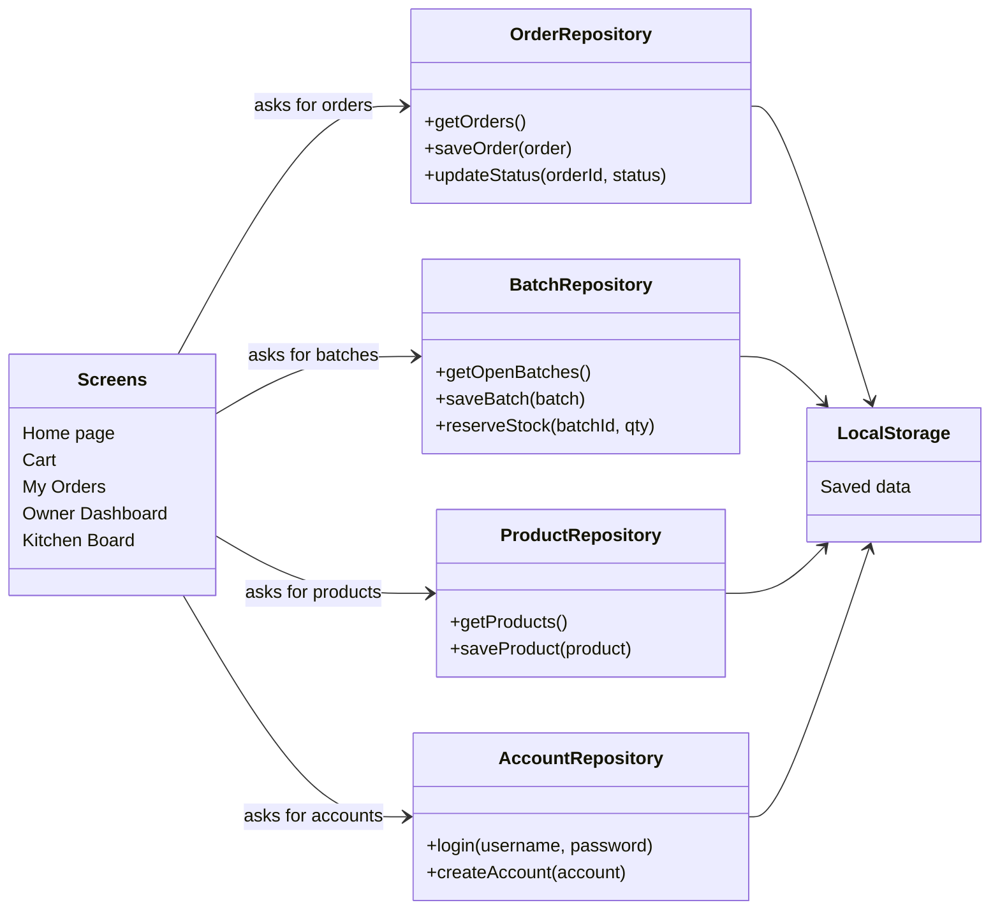

```mermaid
classDiagram
    direction LR
    class Screens {
        Home page
        Cart
        My Orders
        Owner Dashboard
        Kitchen Board
    }
    class OrderRepository {
        +getOrders()
        +saveOrder(order)
        +updateStatus(orderId, status)
    }
    class BatchRepository {
        +getOpenBatches()
        +saveBatch(batch)
        +reserveStock(batchId, qty)
    }
    class ProductRepository {
        +getProducts()
        +saveProduct(product)
    }
    class AccountRepository {
        +login(username, password)
        +createAccount(account)
    }
    class LocalStorage {
        Saved data
    }
    Screens --> OrderRepository : asks for orders
    Screens --> BatchRepository : asks for batches
    Screens --> ProductRepository : asks for products
    Screens --> AccountRepository : asks for accounts
    OrderRepository --> LocalStorage
    BatchRepository --> LocalStorage
    ProductRepository --> LocalStorage
    AccountRepository --> LocalStorage
```
